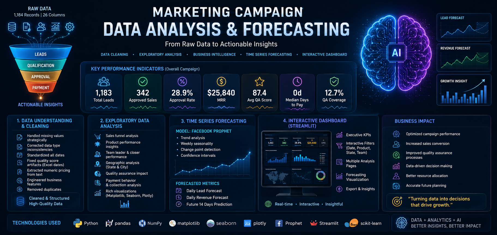

# Marketing Campaign Data Pipeline

## End-to-End Analysis: Operations, Quality Assurance, Sales Tracking & Forecasting

---

## Project Overview
This project was developed as part of a Data technical assessment designed 
to evaluate end-to-end analytical capabilities including:
* Data Understanding
* Data Cleaning & Wrangling
* Exploratory Data Analysis (EDA)
* Business Intelligence & KPI Analysis
* Time-Series Forecasting
* Interactive Dashboard Development
The dataset contains operational, quality assurance, and sales records for 
a marketing campaign. The objective is to transform raw campaign data into 
actionable business insights and forecast future performance.
---
## Business Problem
Marketing and sales teams need visibility into campaign performance, 
quality assurance processes, sales conversion rates, and future lead 
generation trends.
This project aims to answer key business questions:
* How effective is the sales funnel?
* Which products generate the highest sales?
* Which team leaders and closers perform best?
* How does quality assurance impact operational performance?
* Which states generate the most revenue?
* What are the expected lead and revenue trends in the coming weeks?
<p align="center">
  
</p>

## Quick Start

### Prerequisites

```bash
pip install -r requirements.txt
```

### Run the Dashboard

```bash
streamlit run dashboard/app.py
```

**Local:** http://localhost:8501  
**Published:** https://end-to-end-timeseries-forecasting-mfrk3kfsg3hd7pvi5hbkw9.streamlit.app/

### Run the Analysis Notebook

```bash
jupyter notebook
```

Open: `Understanding-Cleaning-EDA-CompaignData.ipynb`

---

## Required Libraries

```text
pandas==2.3.3
numpy==2.3.5
matplotlib==3.10.0
seaborn==0.13.2
plotly==6.8.0
streamlit==1.58.0
scikit-learn==1.9.0
statsmodels==0.14.6
prophet==1.3.0
joblib==1.5.3
openpyxl==3.1.5
pyarrow==24.0.0
kaleido==1.1.0
requests==2.34.2
```

---

## Main Business Takeaways

### 1. Closer Concentration Risk

The top 3 closers handle the vast majority of all approved sales volume. This creates a key-person dependency — if any leave or underperform, campaign revenue drops sharply. **Invest in training mid-tier closers now.**

### 2. Low QA Coverage

Only a fraction of records received a quality review. At this rate, QA scores reflect spot-checks rather than campaign-wide quality. **Expand to a random 30-40% sample minimum to surface issues at scale.**

### 3. Payment Tail Risk

While many approved sales settle same-day, a meaningful long tail stretches 30–60+ days post-creation. **Prioritise follow-up on accounts past 14 days to accelerate cash collection and reduce churn risk.**

---

## Project Structure

```text
end-to-end-TimeSeries-forcasting/
│
├── data/
│   ├── sample_data.csv
│   └── data_cleaned.csv
│
├── dashboard/
│   └── app.py                    # Streamlit dashboard
│
├── notebooks/
│   └── Understanding-Cleaning-EDA-CompaignData.ipynb
│
├── models/
│   ├── lead_prophet.pkl
│   └── revenue_prophet.pkl
│
├── images/
│   ├── sales_funnel.png
│   ├── qa_analysis.png
│   ├── state_analysis.png
│   ├── product_analysis.png
│   ├── team_performance.png
│   └── forecast.png
│
├── requirements.txt
├── environment.yml
├── README.md
└── .gitignore
```

---

## Project Overview

This project demonstrates end-to-end data capabilities from ingestion and cleaning to advanced analysis, time-series forecasting, and interactive reporting.

**Dataset:** 1,183 rows, 31 features covering operations, QA, sales, and payment records.

**Phases:**
1. Data Understanding & Cleaning
2. Exploratory Data Analysis (EDA)
3. Time-Series Forecasting
4. Interactive Dashboard Development

---

## Data Cleaning Notes

### Issues Handled

- **Mixed data types:** Standardized numeric and text columns
- **Missing values:** Preserved QA missing values (represent unreviewed records), filled customer demographics with "Unknown"
- **Inconsistent date formats:** Converted 7 date columns to datetime
- **Excel artifacts:** Recovered quality scores incorrectly converted to dates (e.g., "10-Aug" → 80)
- **Text-based pricing:** Extracted numeric values from pricing strings
- **Duplicates:** Removed 1 verified duplicate record

### Feature Engineering

| Feature | Description |
|---------|-------------|
| `Is Approved` | Binary flag for approved sales |
| `Has Qa` | Binary flag for QA-reviewed records |
| `Days To Payment` | Time between sale and payment |
| `Monthly Price` | Numeric revenue per sale |

---

## Prophet Forecasting Notes

### Model Configuration

```python
Prophet(
    yearly_seasonality=False,
    weekly_seasonality=True,
    daily_seasonality=False,
    changepoint_prior_scale=0.1,
    interval_width=0.80
)
```

### Issues Encountered & Resolutions

1. **TypeError: `add_vline` received string instead of datetime**
   - **Issue:** Passing string index to `fig.add_vline()`
   - **Fix:** Use datetime object from dataframe: `split_date = daily["ds"].iloc[split_idx]`

2. **TypeError: Multiple values for `legend` in `update_layout`**
   - **Issue:** `LAYOUT_BASE` already contained `legend` key, then passed explicitly again
   - **Fix:** Exclude `legend` from dictionary unpacking: `**{k: v for k, v in LAYOUT_BASE.items() if k not in ("xaxis","yaxis","legend")}`

3. **ImportError: Prophet not installed**
   - **Issue:** Missing dependency in some environments
   - **Fix:** Added linear regression fallback with warning to install Prophet

### Forecast Results

- **Lead Trend:** Positive growth trajectory throughout campaign period
- **Weekly Seasonality:** Strongest performance on weekdays (peak: Thursday), lower on weekends
- **Recommendation:** Concentrate staffing and QA resources on peak weekday periods

---

## Dashboard Features

### Tab 1: Overview & KPIs
- 7 KPI cards (Total Leads, Approved Sales, Approval Rate, Revenue, QA Score, Days to Pay, QA Coverage)
- Lead disposition by status
- Product mix analysis
- Top 10 closers and openers
- Product volume, revenue, and price tier breakdowns

### Tab 2: Deep-Dive Analysis
- Quality score distribution (with mean/median)
- Approval rate by gender
- Days to payment histogram
- State-level lead volume and conversion rates
- QA score by agent
- QA coverage pie chart
- Quality score vs sale outcome
- Team leader performance table
- Top cities and gender distribution
- Raw data explorer with statistical summary

### Tab 3: Time-Series Forecast
- Daily campaign activity (leads + approved with 7-day rolling averages)
- Prophet forecast with 80% confidence intervals
- Forecast settings (7-30 day horizon)
- Forecast components plot (trend, weekly seasonality)
- Linear regression fallback if Prophet unavailable

---

## Technologies Used

| Category | Libraries |
|----------|-----------|
| Data Processing | Python, Pandas, NumPy |
| Visualization | Matplotlib, Seaborn, Plotly |
| Forecasting | Prophet, Scikit-Learn, Statsmodels |
| Dashboard | Streamlit |
| Utilities | Joblib, PyArrow, Kaleido |

---

## Author

**Youssef Bassiony**  
Data Scientist | Business Analytics | Machine Learning

GitHub: https://github.com/youssef-113
